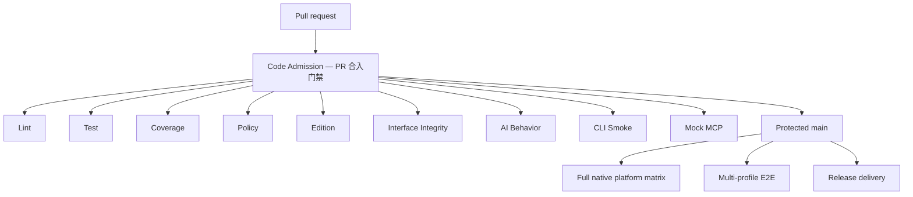

# Code Admission — PR 合入门禁

The pull-request admission layer has exactly nine required external contexts:

| Required context | Contract |
|---|---|
| `Lint` | Stable PR revision classification, formatting, `go vet`, and Actionlint |
| `Test` | Race/unit/release-script tests plus fast cross-platform compilation |
| `Coverage` | Overall non-regression and changed-code coverage |
| `Policy` | Repository policy and the fail-closed CHANGELOG contract |
| `Edition` | Edition contract tests |
| `Interface Integrity` | CLI, Schema, Skill, and stable-release compatibility |
| `AI Behavior` | Base-owned policy for PRs labeled `ai-generated` |
| `CLI Smoke` | Offline help for every public top-level command |
| `Mock MCP` | HTTP and stdio MCP lifecycle smoke tests |

The workflow display name is `Code Admission — PR 合入门禁`. Parallel helper
jobs may implement `Test` and `Coverage`, but they are not ruleset contexts.
Do not require an aggregate alias or a downstream integration check in place of
the nine contracts above.

`AI Behavior` is evaluated by a `pull_request_target` workflow that never
checks out or executes PR code. It writes the exact `AI Behavior` status to the
current PR head. Its Files API read is bracketed by base/head revision checks,
so a synchronize race fails closed. The same workflow supplies a successful
`AI Behavior` check run on protected `main` pushes for release governance.

## Exact CHANGELOG-only fast path

A pull request qualifies only when GitHub reports exactly one changed file,
that file is an in-place modification of `CHANGELOG.md`, and the base and head
both retain it as a regular non-executable `100644` blob. Add, delete, rename,
symlink, executable-mode, and second-file changes do not qualify.

`Lint` classifies the Files API result only after verifying that the API's base
and head equal the event revision both before and after pagination. `Policy`
checks out GitHub's PR merge ref and verifies its parents:

```text
HEAD^1 = pull_request.base.sha
HEAD^2 = pull_request.head.sha
```

It then runs:

```sh
./scripts/policy/check-changelog-pr.sh \
  --fast-path "$PR_BASE_SHA" HEAD
```

Because the verified PR diff contains only `CHANGELOG.md`, the validator and
its policy dependencies in that merge tree are byte-for-byte the current base
versions. Validation targets the synthetic merge tree, not the feature-branch
tree, so a stale branch cannot supply an older validator or combine with newer
base notes into an invalid final CHANGELOG.

All nine admission contexts are still emitted and must succeed. Expensive
implementation helpers are skipped; the named contexts record that their code
surface is unaffected. After merge, the protected `main` push executes the
full admission suite.

Any PR that touches `CHANGELOG.md` but also changes another file runs the same
content contract in `Policy` with `--content-only`. That mode permits the
second file but still rejects invalid dates or versions, missing bullets,
placeholder `TODO`/`TBD`, unmanaged-section changes, and unsafe tree modes.
Adding a second file therefore cannot bypass CHANGELOG validation.

## Platform and downstream boundaries

Ordinary PRs run the primary Linux assurance plus fast Darwin/Windows compile
checks. Full native macOS/Windows tests and platform coverage run on a PR only
when its diff touches auth, keychain, OS-specific Go files, installers,
packaging, Formulae, or release automation. Protected `main` pushes run the
complete native matrix.

Complete `Multi-profile E2E` is not a PR admission context. It belongs to the
`Main Integration — 主干集成` workflow and runs only after a push to `main` (or
an explicit manual dispatch). A failing downstream run remains a real
regression and must be repaired, but it must not be represented by a synthetic
successful PR check.



## Running focused gates locally

Run the contracts relevant to the change:

```sh
make build
make policy
make interface-integrity
make authoritative-interface-integrity BASE_REF=<merge-base>
make schema-compatibility BASE_REF=<merge-base>
make skill-command-integrity
make cli-smoke
make mock-mcp-smoke
go test -v -count=1 ./pkg/editiontest/...
```

For an exact CHANGELOG-only branch:

```sh
base_ref=$(git merge-base HEAD origin/main)
./scripts/policy/check-changelog-pr.sh --fast-path "$base_ref" HEAD
```

`make coverage-gate` is an enforcement step, not a profile generator. CI
generates the candidate, supporting, merge-base, and (when risk-selected)
native profiles before the aggregate `Coverage` context evaluates them.

Compatibility checks derive authoritative Interface snapshots from the PR
merge-base and the latest reachable stable release. The candidate cannot bless
a breaking change by editing a fixture. Schema additions are allowed;
historical products, tools, parameters, mappings, positional execution fields,
constraints, and safety semantics remain protected.

## Required GitHub repository settings

The `main` quality ruleset must enable strict required-status-check policy
(`strict_required_status_checks_policy=true`) so a PR is revalidated whenever
`main` advances. It must require these exact contexts and no legacy aliases:

- `Lint`
- `Test`
- `Coverage`
- `Policy`
- `Edition`
- `Interface Integrity`
- `AI Behavior`
- `CLI Smoke`
- `Mock MCP`

Do not require helper jobs, `Multi-profile E2E`, or an aggregate admission
alias. Update ruleset contexts only after the new names have appeared on the
protected branch, so a rename cannot silently remove enforcement or leave an
unproducible required context.
