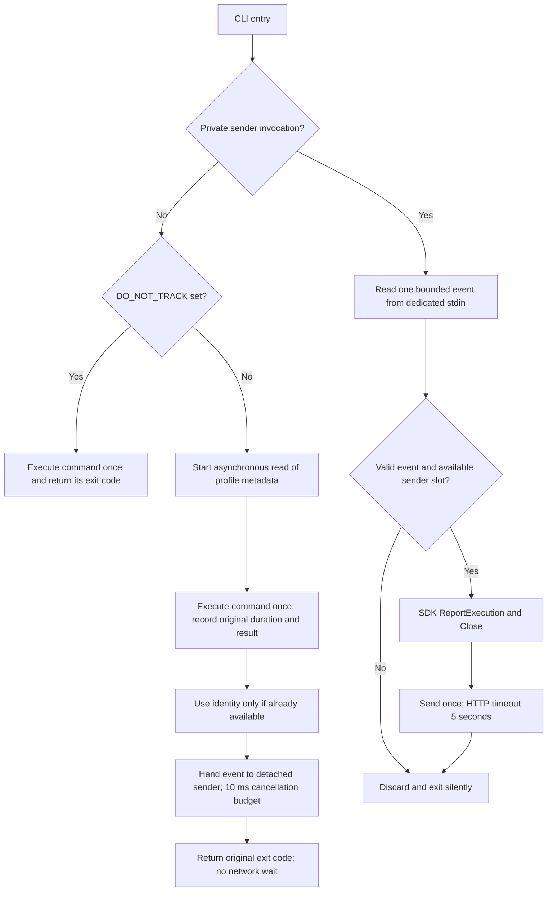

# CLI telemetry integration

DWS embeds AEM Go SDK v0.4.0 at commit
`4a6f824d78312308359f85fa474897430a61681e`. The local module replacement keeps
public builds independent of private repository access. Local extensions and
source provenance are documented in `third_party/aem-go-sdk/README.md`.

## Command and sender lifecycle



The SDK's standard `Run` adapter waits up to 300 ms for flush before exiting.
An asynchronous HTTP queue alone therefore does not imply zero CLI exit delay.
DWS instead passes the completed result to an internal invocation of the same
binary. The sender never assembles Cobra commands, executes authentication,
initializes the native Runtime SDK, or launches another sender.

The command process preserves business stdout/stderr, TTY detection, exit codes,
and timing. Identity comes only from a read-only profile metadata snapshot; it
does not read tokens, open Keychain, refresh credentials, or migrate files. A
slow or failed identity read produces an anonymous event. The read starts before
command execution but is best effort: concurrent login/logout can change which
metadata is available. Multiple-profile selection follows the existing default
profile attribution rule.

The local handoff uses a dedicated stdin pipe with a versioned event, capped at
4 KiB, with a 10 ms cancellation budget. This is not a hard real-time wall-clock
guarantee under operating-system scheduling delays. No event is stored in argv,
environment variables, logs, or a disk queue. The sender's stdout/stderr are connected to the null device and its
terminal lifecycle is detached. It cannot hold the caller's output pipes open.
Local process startup, marshaling, and handoff still have a small measurable CPU,
memory, and latency cost; this integration does not claim zero overhead.

Each sender has a six-second lifetime limit. Sending uses the SDK's five-second
HTTP timeout, without retries. Eight nonblocking lock slots under the user's
cache directory bound simultaneous send operations; slot files contain no event
data. Excess senders, unavailable cache directories, malformed/oversized events,
failed starts, timeouts, and SDK errors silently discard the event. A successful
pipe handoff is not confirmation that AEM received or stored the event.

## Existing field contract

| Fields | Meaning |
| --- | --- |
| `pid`, `app_name`, `env`, `platform` | Existing DWS project, `dws`, `prod`, `cli` |
| `version`, `app_version` | Original command's application version |
| `uid`, `username` | Available reviewed profile identity; omitted otherwise |
| `type`, `p1`, `p4` | `event`, `cli.exec`, `SYS` |
| `c1`, `c3`, `c4`, `ts` | Original executable basename, exit code, duration in ms, completion timestamp |
| `c5` | Existing sanitized error summary, at most 200 Unicode characters |
| `c9`, `c10` | Canonical command path and available enterprise ID |

**p2/p3 collection and reporting are disabled.** This includes environment
attribution and process ancestry probes, not merely removal of their output.
Arguments, stdout, cwd, shell, session, locale, MAC/device fingerprints, and the
other previously disabled automatic dimensions remain disabled.

v0.4.0 rejects `ExtraFields` overrides of p1–p4 and c1–c8. DWS uses the typed
completed-execution API for c5; only c9/c10 are supplied through `ExtraFields`.
Errors remain presented once by the business command. Any nonblank
`DO_NOT_TRACK` value (including `0`) skips identity reading, sender launch, and
reporting altogether.

## Validation

- `make test-aem` runs the nested SDK tests, including the opt-outs and completed
  execution API. Root `go test ./...` alone does not traverse nested Go modules.
- `go test ./cmd ./internal/telemetry` exercises entrypoint behavior, exact final
  wire fields, detached transmission after parent exit, pipe EOF, malformed
  events, time limits, and sender saturation. Run with `-race` where supported.
- Compare matched telemetry-on/off binaries using version/help/invalid-input and
  local mock business commands. Use at least 100 samples per mode and report
  parent p50/p95/p99, CPU, allocations, and parent/worker memory. The acceptance
  targets are additional parent p95 <=10 ms and p99 <=20 ms; slow DNS or response
  handling must not add a network timeout to the command.
- Verify platform ingestion separately using anonymous synthetic data and a
  unique test version. Local payload capture or an HTTP success response alone
  does not establish that an AEM event is stored and queryable. Record platform
  or native checks that could not be completed rather than counting them as passes.

### Reproduce local packaging and installation checks

The following recipe is for macOS arm64 with Xcode command-line tools, Go
1.25.9, Python 3.9+, Node.js/npm, Homebrew, `tar`, `zip`, and `unzip` on PATH.
Run from a clean repository checkout. The host must permit executing local
ad-hoc-signed binaries; a valid `codesign --verify` result alone does not
establish that the host trust policy permits execution. Record an AMFI refusal
as an unverified install, not a pass. It creates local smoke archives, uses
ad-hoc signing, and runs the real npm and Homebrew installers without Docker or
release credentials. Five targets use CGO=0; the host target uses CGO=1/SafeChat.
These smoke archives do not replace the production six-target CGO release gate.
The Homebrew verifier installs and removes only its dedicated
`dingtalk-workspace-cli-local` formula; preserve a pre-existing installation by
stopping at the guard below.

```sh
set -eu
export DWS_REPRO_ROOT="$(pwd)/.tmp/codex/install-review-$(date +%Y%m%d%H%M%S)"
mkdir -p "$DWS_REPRO_ROOT/tmp" "$DWS_REPRO_ROOT/dist"
export TMPDIR="$DWS_REPRO_ROOT/tmp" GOTMPDIR="$DWS_REPRO_ROOT/tmp"
export GOTOOLCHAIN=go1.25.9 CC=/usr/bin/clang CXX=/usr/bin/clang++
export DWS_PACKAGE_DIST_DIR="$DWS_REPRO_ROOT/dist"
export DWS_PACKAGE_VERSION=0.0.0-review DO_NOT_TRACK=1
export DWS_APPLE_CERTIFICATE_P12= DWS_APPLE_CERTIFICATE_PASSWORD_FILE=
export DWS_REQUIRE_DEVELOPER_ID_SIGNING=false
unset DWS_RELEASE_BASE_URL
python3 - <<'PY'
import hashlib, os, pathlib, subprocess, tarfile, zipfile
root = pathlib.Path.cwd()
work = pathlib.Path(os.environ['DWS_REPRO_ROOT'])
dist = pathlib.Path(os.environ['DWS_PACKAGE_DIST_DIR'])
archives = []
for system in ('darwin', 'linux', 'windows'):
    for arch in ('amd64', 'arm64'):
        stage = work / (system + '-' + arch)
        stage.mkdir()
        binary = stage / ('dws.exe' if system == 'windows' else 'dws')
        env = dict(os.environ, GOOS=system, GOARCH=arch,
                   CGO_ENABLED='1' if (system, arch) == ('darwin', 'arm64') else '0')
        version = 'v' + env['DWS_PACKAGE_VERSION']
        flags = '-s -w -X github.com/DingTalk-Real-AI/dingtalk-workspace-cli/internal/app.version=' + version
        subprocess.run(['go', 'build', '-buildmode=pie', '-trimpath',
                        '-ldflags=' + flags, '-o', str(binary), './cmd'], env=env, check=True)
        entries = [(binary, binary.name)] + [(root / p, p) for p in ('LICENSE', 'NOTICE', 'README.md', 'CHANGELOG.md')]
        archive = dist / ('dws-' + system + '-' + arch + ('.zip' if system == 'windows' else '.tar.gz'))
        if system == 'windows':
            with zipfile.ZipFile(archive, 'w', zipfile.ZIP_DEFLATED) as output:
                for source, name in entries:
                    output.write(source, name)
        else:
            with tarfile.open(archive, 'w:gz') as output:
                for source, name in entries:
                    output.add(source, arcname=name)
        archives.append(archive)
(dist / 'checksums.txt').write_text(''.join(hashlib.sha256(p.read_bytes()).hexdigest() + '  ' + p.name + '\n' for p in archives))
PY
./scripts/release/post-goreleaser.sh
./scripts/release/verify-package-managers.sh --npm-only --expected-version "$DWS_PACKAGE_VERSION"
if [ -n "$(brew list --formula --versions dingtalk-workspace-cli-local 2>/dev/null)" ]; then
  printf '%s\n' 'Preserve the existing local verification formula; stop here.' >&2
  exit 1
else
  ./scripts/release/verify-package-managers.sh --brew-only --expected-version "$DWS_PACKAGE_VERSION"
fi
```

The npm verifier exercises both specific-agent-root and generic-fallback
installations. The Homebrew verifier uses a temporary tap and a keg-only formula.
Both execute the installed binary's help and verify the expected version and
skill assets; neither invokes authentication or the native Runtime SDK.

### Reproduce parent-latency measurements

Use the packaged host binary from the preceding recipe, with no concurrent
builds or other benchmarks. The harness needs Python 3.9+ on macOS or Linux. It
isolates HOME/config/cache, supplies no credentials, directs telemetry to a slow
loopback proxy, and checks identical stdout/stderr and exit status between modes.
Version/help/invalid-input commands do not initialize the native Runtime SDK.
The result records all samples, binary SHA-256, host/Python version, percentile
method, parent CPU time, and whether the proxy received traffic. Its scope does
not include worker memory, allocations, or live platform ingestion.

```sh
mkdir -p "$DWS_REPRO_ROOT/packaged-host"
tar -xzf "$DWS_PACKAGE_DIST_DIR/dws-darwin-arm64.tar.gz" -C "$DWS_REPRO_ROOT/packaged-host"
python3 scripts/dev/benchmark-telemetry.py \
  --binary "$DWS_REPRO_ROOT/packaged-host/dws" \
  --work-dir "$DWS_REPRO_ROOT/benchmark" \
  --output "$DWS_REPRO_ROOT/latency.json" --samples 400
```

The fixed run uses five warmups and 400 samples per mode per scenario, with
alternating on/off order. Exit 0 requires additional p95 <=10 ms and p99 <=20 ms
and observed proxy traffic. Preserve a failed run; do not change thresholds or
stop sampling when a partial result passes. A result describes its recorded
binary and host, not a universal latency guarantee. Live AEM query observations
require a separately authorized platform environment and are not a substitute
for these reproducible local checks.
