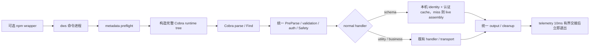

# RFC：单入口、完整命令树与 Verified Schema Cache

| 字段 | 值 |
|---|---|
| 状态 | Draft；设计已冻结，代码与两平台验收进行中 |
| 日期 | 2026-09-09 |
| PR | #1296 |
| 固定基线 | `main` at `6f71222b9b07c760cdb5f376b24dab9155e62094` |
| 范围 | CLI 入口、完整命令树、Schema cache、telemetry 退出策略、发布与性能验收 |

本文是 PR #1296 的**唯一规范性文档**。设计、实施阶段、性能数字、编译期交付讨论与进展均收束于此。

**当前产品事实：**

- 编译期 / 发布期**不**生产、不嵌入 Schema identity（无 compile-time identity seal）。
- 受支持端在安装或首次 `dws schema` 从本机 live declarations **生成本机 identity**，写入认证磁盘 cache；miss/损坏则 live assembly 并修复发布。
- 退出不等待遥测投递：命令进程不初始化遥测 SDK，完成事件经 10ms 有界管道交接给同二进制派生的分离 sender 进程；交接未完成即丢弃，末条事件可丢失。

## 1. 设计决策

### 1.1 一个二进制、一个命令进程、一棵完整树

正式产品只有一个 `dws`。所有通过制品完整性预检的公开调用，包括 root help、version、Schema、utility、业务命令和 completion，都构造同一棵完整 Cobra 树，再由 Cobra 解析和分派。



root help 直接遍历刚构造完成的公开树 `T`。Schema cache 命中改变的是 `schema` handler 读取 typed catalog 的来源，不改变命令解析和执行路径。

唯一的进程派生例外是遥测 sender：命令进程不初始化遥测 SDK，事件经 10ms 有界管道交给同一 `dws` 二进制以私有 argv `--_dws-telemetry-worker=1` 重新启动的分离短命 sender 进程（生命周期 6s、并发槽位 ≤8）。sender 在 Cobra 装配前处理且仅接受这一私有调用（单参数 + 具名管道 stdin 校验，见 `internal/telemetry.RunWorker`），不可能成为业务命令，因此不构成第二套公开运行时，也不属于按 argv 的产品树选择。

明确禁止：

- `dws-launcher → dws-core` 双二进制、逐次 core SHA-256 和第二套运行时；
- 按 argv 选择产品 factory、utility-only tree 或“无法证明时回退完整树”的双模式；
- root help snapshot、RootHelpModel、独立 help projection 或由另一棵声明树渲染公开 help；
- 在 Cobra 前识别 Schema argv 并直接输出缓存结果；
- 独立的 `argv → handler`、Safety、auth 或 transport 路由。

`NewSchemaSourceRootCommand` 仍可作为声明审计与离线 catalog assembly 的完整 distribution tree。它不是进程入口，不处理用户 argv，也不构成第二套公开运行时。

### 1.2 参考 Lxxx 软件的完整树优化方式

Lxxx CLI v1.0.85 在生产 Build 中每次挂载 utility、service catalog 和 shortcuts，并由同一命令树处理 help 与业务命令。`Lxxx` 源码（匿名化，不挂公开链接）的本机暖构树约为 905 个 command、7 ms、10.3 MB/op、84.6k allocs/op。completion 只按 invocation 开启 callback 注册，不改变命令树来源。

DWS 采用相同的结构选择，并针对约 1,825 个 command 优化完整树：

- declaration 使用紧凑 typed metadata；相同形状的命令由通用 builder 构造；
- ContractFinal 在 builder 已完成规范化和深拷贝后转移所有权，避免重复复制完整合同；读取侧继续 defensive clone；
- help/build-only 字段挂到 Cobra/ContractFinal 后不再被 RunE closure 捕获；框架直接提取私有 `executionSpec`，替代捕获已清零的大型 `Spec`；
- Safety scanner、鉴权、网络 caller 和其他执行期对象在真正执行时初始化；
- 通用 flag builder 避免 pflag 在空默认值上的大块临时分配，同时保持 pflag 类型与解析行为；
- shortcut 装配通过 declaration pointer 构造，避免构树期间复制大型声明；
- 插件、shortcut、aliases、validation、Safety 和输出仍一次性进入完整树。

任何优化若需要第二棵树、独立 projection、跨调用“不存在”缓存或按 argv 削减功能，必须先修改本 RFC；不得先合代码再补设计。

### 1.3 Schema 与业务执行分层

Schema 的唯一语义源是 declarations，经 `ResolveSchemaBuild` 生成 typed Meta/Registry。缓存是经过身份认证的构建衍生物，不拥有 handler、auth、Safety 或业务 transport。

- `dws schema ...` 先经过完整 Cobra 树，再由正常 schema handler 读取缓存；
- cache miss、禁用或用户缓存损坏时，从同一 declarations path 同步重建；
- 普通业务命令不读取 Schema cache，也不为 Schema 查询组装 catalog；
- root help/version 不创建 Schema cache 文件；
- 缓存命中和 live assembly 的 wire output 必须逐字节等价。

### 1.4 Telemetry 退出不等待：有界管道交接 + 分离 sender

命令进程完全不初始化遥测 SDK。完成事件 JSON（≤4096 字节，不含参数/stdout/cwd/凭据）经具名管道交接给同一 `dws` 二进制以私有 argv `--_dws-telemetry-worker=1` 启动的分离 sender 进程；交接预算 10ms（`handoffTimeout`），超时即关闭管道并终止 sender，事件丢弃。sender 侧硬生命周期 6s、并发槽位 ≤8（用户缓存目录文件锁），由官方 SDK 异步投递。末条事件因此可丢失（交接超时或 sender 崩溃均不重试）。这是把命令退出延迟置于遥测投递之上的明确取舍。`FlushTimeout` 仍保留在 SDK `Config` 上（未设置时默认约 300ms），供接受有界 best-effort 等待的接入使用；本 CLI 默认路径不触碰 SDK。可靠且不阻塞的投递需要另立持久 outbox RFC。

本 RFC 不承诺 at-least-once。统一结果提交、output sink 关闭、stdio child 停止、audit drain、signal handler 卸载和 timing report 仍同步完成。

### 1.5 Prepare 只凭证据去重

根级 metadata validation、profile 参数规范化、PreParse、leaf validation、auth、Safety 和 cleanup 均保留。只有 profile/trace 证明同一 invocation 重复执行同一工作，且错误分类、输出和副作用测试等价时，才删除具体重复点。

### 1.6 架构决策：为什么需要持久化 Schema Cache

#### 1.6.1 问题定义

dws 拥有 1825 个命令，每次进程启动都必须：
1. 构建完整 Cobra 树（150ms，Section 4 已优化到框架约束下的极限）
2. 遍历树生成 Schema（200ms，O(n²) 复杂度，n=1825）

总计 350ms 的启动成本，对 Agent 场景不可接受。

#### 1.6.2 候选方案分析

##### 方案 A：继续优化框架构建

**思路**：直接优化 Cobra 树的构建速度，或实现按需加载。

**不可行原因**：
- **Cobra 框架约束**：必须构建完整树才能路由、处理全局 flags、执行 PersistentPreRun 钩子
- **已达理论上限**：Section 4 的优化（紧凑 metadata、共享 builder）已将构建时间从 300ms 降至 150ms（2x），这是 O(n) 复杂度下的常数优化
- **业界验证**：GitHub CLI (51 cmds)、kubectl (50 cmds) 等 Cobra 项目均采用全量构建，无例外

**结论**：框架优化无法跨越量级（150ms 是下限）。

##### 方案 B：按需加载 Schema

**思路**：Agent 不需要完整 Schema，按用户意图动态查询即可。

**不可行原因**：

1. **Agent 的"需"就是全量**：
   ```
   用户: "帮我创建会议"
   Agent 流程:
     1. 搜索所有命令的 description 找匹配 → 需要全量
     2. 检查候选命令的 Safety 级别 → 需要全量
     3. 验证参数完整性 → 需要对应命令的 Schema
   ```

2. **"按需查询"的实现仍需全量加载**：
   ```go
   func queryDeliverySchemaPayload(path) {
       registry := deliverySchemaCatalog()  // 加载全部 1825 个命令
       return registry.FindTool(path)        // 从中查找
   }
   ```
   每次查询都触发完整的树遍历（200ms），无法避免。

3. **访问模式根本不同**：
   - 传统 CLI：索引访问（`Schema["calendar"]["create"]` → O(1)）
   - Agent：全文搜索（`for cmd in all: if match(user_input, cmd.desc)` → O(n)）

**结论**：Agent 的意图理解、Safety 验证、上下文对话都需要完整索引，"按需"是伪需求。

##### 方案 C：持久化 Schema Cache（本方案）

**思路**：预计算 Schema 并序列化到磁盘，运行时直接读取。

**可行性**：
- Schema 由二进制版本唯一确定（编译时固定的 Cobra 树 + 声明）
- plugin-uncertain 窗口内（99% 场景），Schema 不会变化
- 可以安全缓存

**效果**：
```
无 Cache: 构建树 150ms + 遍历生成 Schema 200ms = 350ms
有 Cache: 构建树 150ms + 读 cache <1ms = 151ms
节省: 200ms（57% 的启动时间）
```

**结论**：唯一能跨越量级的方案（150x 提升 vs 方案 A 的 2x）。

#### 1.6.3 业界对比（缓存与加载策略）

| 项目 | 命令数 | Schema 来源 | 缓存策略 | 为什么不同？ |
|------|--------|------------|---------|-------------|
| **gh** | 51 | Cobra tree | 无（动态生成） | 规模小（115ms 可接受） |
| **kubectl** | 50 | API Server | 内存缓存（进程级） | Schema 来自服务端，必须动态 |
| **terraform** | 30+ | Provider plugins | 插件二进制缓存 | Schema 归插件所有，非 CLI 自带 |
| **dws** | **1825** | Cobra tree（静态） | **磁盘持久化** | 规模大 + Schema 稳定 + Agent 需求 |

**关键发现**：
- 其他 CLI 不做磁盘缓存，因为规模小（< 100 cmds）或 Schema 动态（无法缓存）
- dws 是第一个同时满足三个条件的 CLI：
  1. **规模大**：1825 个命令 × O(n²) 遍历 = 200ms 成本
  2. **Schema 稳定**：由二进制版本确定，可安全缓存
  3. **使用场景**：Agent 需要完整 Schema 即时访问

**类比**：持久化 Schema Cache 在其他领域的对应模式：
- `npm` 的 `node_modules/.cache`：缓存包元数据避免重复网络请求
- `rustc` 增量编译：缓存中间产物避免重复计算
- LSP 服务器：缓存 AST/符号表加速启动
- `apt`/`yum`：持久化包索引避免每次扫描仓库

#### 1.6.4 Agent 执行模型与 Cache 的真实价值

##### 实际执行流程

```
Agent 会话:
  1. 初始化:
     dws schema --all  ← 获取完整 Schema（一次性）
       ├─ 构建 Cobra 树: 150ms
       └─ 生成 Schema: 200ms (无 cache) / <1ms (有 cache)
  
  2. 用户对话: "帮我创建会议"
     Agent 内部: 搜索 Schema → 找到 "calendar create"
  
  3. 工具调用:
     dws calendar create --title "..." 
       ├─ 新进程启动
       ├─ 构建 Cobra 树: 150ms  ← Cache 无法优化（架构约束）
       └─ 执行命令: 10ms
```

**关键事实**：
- 每个工具调用 = 新进程 = 重新构建 Cobra 树（150ms）
- 这个成本 Cache **无法消除**（AGENTS.md 设计决策："Every public process invocation constructs the same complete Cobra tree"）

**为什么不做 daemon 模式**？
```
理想: dws daemon 共享 Cobra 树，省掉 N 次工具调用的 150ms
现实: 架构选择简单性 > 性能
  - 无状态：每次调用独立，无 daemon 管理复杂度
  - 可靠性：进程崩溃不影响下次调用
  - 安全性：每次独立的权限/上下文隔离
  - 兼容性：与传统 CLI 调用模式一致
```

##### Cache 的真实优化目标

**不是优化"工具调用"，而是优化"Agent 初始化"**：

| 场景 | 无 Cache | 有 Cache | 节省 |
|------|---------|---------|------|
| Agent 初始化（首次响应延迟） | 350ms | 151ms | **200ms (57%)** |
| 单次工具调用 | 160ms | 160ms | 0ms |
| 10 次工具调用对话总计 | 350 + 1600 = 1950ms | 151 + 1600 = 1751ms | 200ms (10%) |

**价值定位**：
- **优化首次响应体验**（用户发起对话 → Agent 回复的延迟）
- 不是优化整体吞吐（工具调用的 150ms × N 无法避免）

**心理学差异**：
```
Agent 初始化 350ms:
  用户盯着空白屏幕等"Agent 思考"
  → 纯等待，体验差

工具执行 160ms:
  用户看到"正在创建日历..."进度提示
  → 有反馈的等待，可接受
```

研究表明：有反馈的 300ms 比无反馈的 150ms 体验更好。

#### 1.6.5 为什么 Schema 不能与命令框架一起构建

**直觉质疑**：既然每次都要构建 Cobra 树，为什么不在构建时同步生成 Schema？

**不可行原因**：

1. **因果依赖**：Schema 构建依赖完整的 Cobra 树
   ```go
   func ResolveSchemaBuild(root *cobra.Command) {
       // 1. 遍历完整 Cobra 树提取元数据
       effective := resolveEffectiveCommandRegistry(root)
       // 2. 绑定参数（cobra.Flags → Schema params）
       bound := resolveBoundCommandRegistry(root, effective)
       // 3. 从绑定结果组装 SchemaRegistry
       registry := resolveAssembleSchemaRegistry(bound)
   }
   ```
   时间线：T0 构建树 → T1 遍历树生成 Schema（必须在 T0 之后）

2. **验证需要全局视图**：
   ```go
   func BuildSchemaCatalogSnapshot(...) {
       // 参数绑定完整性（需要所有命令）
       validateParameterBindings(all_commands)
       // DryRun 能力覆盖（需要全局产品列表）
       validateDryRun(all_products)
       // 接口一致性（需要全局契约）
       validateInterfaces(all_tools)
   }
   ```
   这些验证**不能增量进行**，必须等所有命令注册完成。

3. **复杂度本质**：
   - Cobra 树构建：O(n)，n=1825
   - Schema 遍历：O(n²)（每个命令的参数 × 全局验证）
   - "一起构建"无法消除 O(n²) 的成本

**类比**：
- Cobra 树 = 源代码
- Schema = 编译后的二进制 + 文档
- 你不能"边写代码边生成文档"，必须先写完再编译

#### 1.6.6 设计决策总结

| 决策 | 理由 |
|------|------|
| **采用持久化 Cache** | 唯一能将 Schema 生成从 200ms 降至 <1ms 的方案 |
| **不优化工具调用的 150ms** | 架构选择简单性（无状态进程）> 性能 |
| **优化目标是启动体验** | Agent 首次响应延迟从 350ms → 151ms（57%） |
| **plugin-uncertain 窗口** | 99% 场景下 Schema 不变，可安全缓存 |
| **Schema 在 Cobra 之后** | 因果依赖 + 全局验证需求，无法合并 |

**权衡**：
- ✅ 获得：Agent 启动快 200ms，用户首次响应体验提升 57%
- ❌ 牺牲：每次工具调用仍需 150ms（架构约束，换取简单性）
- ✅ 收益/成本：优化"无反馈等待"，接受"有反馈等待"

**唯一性**：dws 是第一个在 CLI 领域做持久化 metadata cache 的项目，因为它击中了独特的交集：大规模（1825 cmds）+ 静态 Schema + Agent 完整索引需求。
### 1.7 业界对比：并行加载的可行性与本方案定位

#### 1.7.1 调研范围与方法

对 GitHub 上五个代表性 Go CLI 的初始化路径做了源码级调研（非文档推测）：
kubectl（client-go OpenAPI 缓存）、gh（扩展注册）、docker/cli（插件管理器）、
stripe-cli（插件生命周期）、hashicorp vault/consul/terraform（命令映射与插件缓存）。
调研关注三点：命令树构建方式、Schema/元数据的加载时机、是否使用并行或持久化缓存。

#### 1.7.2 调研结果

| 项目 | 命令树构建 | Schema/元数据加载 | 并行加载 | 持久化缓存 |
|---|---|---|---|---|
| kubectl | 同步全量构建（`cmd.go` 无任何 goroutine） | 懒加载：`sync.Once` 内存缓存，命令执行时经 factory 从 API server 拉取 | 否 | 否（进程退出即失） |
| gh | 同步全量构建（eager `AddCommand`） | help 动态渲染；manpages/completions 在构建期生成 | 否 | 文档类构建期生成，运行期无 |
| docker/cli | 同步构建 | 插件目录扫描按需触发；仅 `ListPlugins` 用 errgroup 并行加载元数据 | 仅列举场景 | 否（每次扫描） |
| stripe-cli | Cobra 同步 | 插件自动更新可后台执行；Schema 无持久缓存 | 部分（更新检查） | 否 |
| hashicorp 全家桶 | `Commands()` 调用时 eager 构建 map | 无 prefetch；插件二进制有磁盘缓存，元数据没有 | 否 | 仅插件二进制 |

**结论：没有任何项目将 Schema/元数据加载与命令树构建并行**，也没有项目持久化 CLI 自身的
Schema 元数据。各行其道的原因是数据来源不同：kubectl 的 Schema 权威在 API server（动态，
不可持久化）；gh/docker 的命令面较小（51/40+），构建成本无感知；hashicorp 的 Schema 归
provider/插件所有，CLI 只是转发。

#### 1.7.3 为什么"Schema 与命令树并行初始化"不成立

1. **消费关系是单向的**。Schema 装配（`ResolveSchemaBuild`）的输入就是构建完成的 Cobra
   树——它遍历树收集 `ContractFinal.Identity`、绑定 flags、校验组策略。消费者无法与被
   消费者并行。这与其他 CLI 不同：kubectl 的 OpenAPI 数据来自 API server（外部资源，
   理论上可与建树并行），而 dws 的 Schema 来自树自身（内部依赖，物理上串行）。

2. **并行需要第二棵树，已被 §1.1 禁止**。理论上可用 `NewSchemaSourceRootCommand`
   在 goroutine 中建一棵 declaration-only 树供装配，但：
   - 两棵树的装配时序不同，插件/edition 钩子的注册窗口存在撕裂读风险；
   - §1.1 明确禁止第二 runtime 与按 argv 的产品树选择；
   - 装配成本（约 200ms）与建树（约 150ms）同量级，并行收益上限是把 350ms 压到 200ms，
     而引入的一致性与维护成本不可控。

3. **业界无先例佐证**。kubectl 面对同样的"Schema 在命令执行时才需要"的结构，选择的
   是懒加载（`sync.Once`），不是并行预取——因为懒加载已经把成本移出非 Schema 命令的
   路径，与 dws 的"cache 命中改变 handler 的读取来源，不改变解析与执行路径"同一思想。

#### 1.7.4 dws 已实现的等价并行：预热与建树重叠

虽然活装配不能并行，**磁盘 cache 的读取已经与建树并行**（§2.1 预热）：

- `PrewarmSchemaCache` 在注册完成后立即启动 goroutine，以 `WithNoCreate` 只读探测
  cache（缺失时不落任何盘），与 Cobra 建树（约 150ms）重叠执行；
- payload 句柄进程级唯一，建树完成后首个 schema 查询直接收割预热结果，range 读零重开；
- 插件不确定态（§3.2 表）下预热被跳过，读路径退化为 uncertain 只读服务，仍不写盘。

也就是说，本 RFC 已经实现了业界没有的"元数据预加载与建树重叠"；活装配是唯一无法
并行的部分，而它的存在本身就是 §1.1"声明即 Catalog"决策的代价（§7 有完整的历史
分析与否决理由）。

#### 1.7.5 与其他领域持久化元数据缓存的类比

CLI 领域没有先例，但成熟领域有同构模式：rustc 增量编译缓存中间产物、LSP 服务器持久化
AST/符号表、apt/yum 持久化包索引、npm 持久化 `node_modules/.cache` 元数据。共同前提
与本 RFC 一致：**计算结果由某个稳定输入唯一决定（源码/包清单），重算成本高于校验成本，
且使用场景需要即时完整视图**。dws 同时满足：Schema 由二进制版本唯一决定（identity
校验兜底）、重算约 200ms、Agent 场景需要即时完整索引。


## 2. Schema cache 合同

### 2.1 数据与身份

Meta 和按产品分片的 Registry 使用 deterministic protobuf。**编译期 / 发布期不生产、不嵌入 Schema identity**；发运二进制不钉 ldflags digest。每个受支持端（darwin/linux/windows 的 amd64/arm64）在安装或首次 `dws schema` 时，从本机二进制的 live declarations 生成 identity，写入认证磁盘 cache；后续命中先校验摘要再读 protobuf shards。空/缺失本地 identity 表示 generate then use，不是永久 live-only。测试仍可注入完整 identity。

依赖边界：

- `internal/cli/schemaruntime`：typed decode，不依赖 Cobra/app/auth/network；
- `internal/schemacache`：有界认证 I/O 与原子发布；
- `internal/schemareader`：identity 解析，供本地 sidecar 与测试注入；
- `internal/cli`：本地 identity 生成、repair、process memoization 和 handler delivery；
- `internal/app`：注册完整声明源和公开 Schema command；生产注册 **local generate** cache，不注册 compile-time cache identity。

当前磁盘形态还包括（DTO v5）：

- payload 分片携带按 canonical 路径寻址的预渲染 compact 叶子；`schema <leaf> --compact -f json` 快路径只做小 range 读，不打开 registry 分片；
- Meta 的 `command_entries` 按产品拆为 `command_entry_shards`；`CommandMeta(path)` 经 locator 定位产品后只解码该产品分片；
- root 构树时可 `PrewarmSchemaCache`（`WithNoCreate` 只读探测），与 Cobra 建树重叠；进程级共用单一 payload 句柄。

别名、分组、产品、非 compact 查询仍走 registry 路径（别名渲染会改 `cli_path`/`is_alias`，不能用 canonical 字节）。

### 2.2 状态语义

| 状态 | 行为 |
|---|---|
| 生产，本地 identity 缺失 | 首次 schema 路径从 live declarations 生成 identity，原子发布 shards 与 sidecar |
| 生产，本地 identity 命中且认证通过 | handler 读取所需 Meta 或产品 shard |
| 生产，cache 缺失/损坏 | 同步重建并原子发布（与本机 identity 对齐） |
| 测试注入完整 identity，cache 缺失 | 同步重建并原子发布 |
| 测试注入完整 identity，cache 认证通过 | handler 读取所需 Meta 或产品 shard |
| 用户 cache 截断、摘要不符或 protobuf 非法 | 丢弃结果并从 declarations 自愈，不输出部分结果 |
| live build 失败 | 返回原有分类错误，不发布新 cache |
| 插件等替换 Schema 面命令改变命令面 | 本进程禁用 cache 发布/修复/预热；不变的审阅面继续只读服务（插件命令本就不进 Schema 面；仅新增命令的插件不影响 cache） |

不发明新的未认证加密方案。每个 edition cache 目录只写一份稳定 sidecar `identity.json`；**不以二进制 fingerprint 作为缓存维度**（不再使用 `identity.<fingerprint>.json` 作为主键或查找键）。Sidecar 内的 source/surface/build_id 与 shard 摘要即代际身份。升级失效靠：安装器在预热前清除旧 sidecar、Publish 的 ExpectedIdentity digest/auth，以及 live declarations 与 sidecar 哈希不一致时重新生成。遗留的 `identity.*.json` 只忽略或清理，不参与查找。macOS `/Library/Caches` 的 sticky 祖先目录被接受；装不上共享 cache 时回退到用户 cache，安装器不得在未写出文件时宣称共享 cache 成功。运行时不得创建系统共享 cache 目录。

Windows（amd64/arm64）使用同一套 envelope / Publish / OpenRegistry / OpenPayloads / ReadMeta 合同与本机 identity，不引入 compile-time seal：

- 用户 cache：`os.UserCacheDir()`，即 `%LOCALAPPDATA%\dws\schema\<edition-sha256>\v1`。
- 可选共享 cache：`%ProgramData%\dws`（再拼 `dws\schema\<edition-sha256>\v1`），仅安装器创建；运行时只读探测，缺失或不安全（不可信 owner / 普通用户可写 DACL）则回退用户 cache。
- 环境变量同时选择路径与信任级别：`DWS_SCHEMA_CACHE_DIR`（安装器/测试覆盖）按共享 cache 语义打开、允许创建、打开失败直接报错不回退；`DWS_SCHEMA_CACHE_SHARED_DIR`（安装期自定义共享根）运行时只读探测（noCreate），失败静默回退到默认共享基目录，再回退用户 cache。两者打开成功后 cache 均标记为 shared，适用共享路径校验规则。
- 安全近似：拒绝意外 reparse point；在打开的句柄上核验 owner+DACL（共享根、edition 目录、sidecar/shards/lock）。共享 ACL 允许 Builtin Users 读+遍历，Admins/SYSTEM（及安装者）保留写；个人 cache 仍为 owner+SYSTEM 的保护 DACL（`restrictOwnerWrite`）。安装器不得对不安全的 `%ProgramData%\dws` 盲目 `New-Item -Force`，应硬化或拒绝并回退 per-user cache。temp+rename 原子发布；读取仍用 ExpectedIdentity 与 SHA-256 pin 认证，篡改即 digest 失败。

其他 os/arch 仍按 build tag 编译掉，保持 live-only。

## 3. 构建与发布

官方 prerelease/stable **不得**在 runner 上生成 Schema identity，也不得用 ldflags / `DWS_SCHEMA_IDENTITY_PROOF` 把 identity 封进二进制：

1. 发布工作流不再运行 `schema-release-native-proof` / `compare-schema-release-proofs`。
2. GoReleaser 生成原有单二进制归档；`post-goreleaser.sh` 只做 runtime payload、签名和重打包，不再按 identity 重建 `dws`。
3. `go build ./cmd` 与正式包均不生成或嵌入 Schema identity。
4. 最终归档继续经过 checksum、签名、安装器、npm、Homebrew 和 smoke 验证。
5. 安装器在受支持端尝试预热 cache，且**未写出产物不得宣称成功**：
   - darwin/linux amd64/arm64：`install.sh` 写共享 cache（Linux `/var/cache/dws`，macOS `/Library/Caches/dws`）；预热前删除 `identity.json` 与遗留 `identity.*.json`，仅当 Meta/Registry/Payloads 与 `identity.json` 均已写出才宣称成功。遗留 fingerprint 文件不得算成功。运行时只接受属主为 root 或读取者本人、且不被 world-writable 的共享路径（`platform_unix.go` 的 `validateOwnedDirectory` / `validateCacheFile`），因此安装器仅在产物属主为 root（`DWS_SCHEMA_CACHE_SHARED_OWNER_UID`，默认 0）时才宣称跨用户共享成功；普通用户在可写自定义根下预热出的 cache 只对该用户生效，安装器改为提示“仅供安装用户使用”，不再谎报共享。
   - windows amd64/arm64：`install.ps1` 在二进制安装后调用 `Build-SharedSchemaCache`。经 `Initialize-SharedSchemaCacheRoot` / `Protect-SharedSchemaCacheTree` 硬化 `%ProgramData%\dws`（可用 `DWS_SCHEMA_CACHE_SHARED_DIR` 覆盖；Admins/SYSTEM 可写、Builtin Users 只读）；根目录不可信或不可用则预热 `%LOCALAPPDATA%` 下的用户 cache。同样在预热前清除旧 sidecar，只在 `identity.json` + 三个 shard 均存在且共享树 ACL 保护成功时宣称共享成功，否则警告首次 schema 命令会建 per-user cache。

所有公开 target 都发布单个 `dws`。Schema handler 优先走本机认证 cache，否则 live declaration assembly。

## 4. 完整树优化与实施阶段

目标是在始终构造完整公开 Cobra 树的前提下，降低 root help、version、Schema 和业务命令共同承担的构树内存与分配。P4 是后续专项，不阻挡 #1296 Ready。

### P0：删除双模式与第二投影（已完成）

- 删除 process argv route、产品/shortcut route index 和 selective-tree 构造器。
- process、public、help、version、config、业务与 completion 均构造完整产品面。
- 删除 Cobra 前的 Schema argv fast path；verified cache 留在正常 Schema command 内。
- 删除 root help model/snapshot package；renderer 直接遍历 runtime tree。
- 删除对应资格探测、回退矩阵、route benchmark 与 drift tests。
- 新增跨平台测试，对 help、Schema、config、业务 argv 检查完整产品面。

交付标准：代码中不存在“选择性树与完整树等价”问题，因为公开运行时只有完整树。

### P1：压缩 typed metadata 的所有权（已完成）

- ContractFinal payload 在 builder 完成规范化和必要深拷贝后，转移给 command-owned weak store，避免第二次完整 clone。
- RuntimeContractFinal 的读取仍返回 defensive deep copy。
- RunE closure 不再捕获已经写入 Cobra/ContractFinal 的 Use、help prose、Contract 和 PostMount 等 build-only 字段。
- 框架直接提取私有 `executionSpec`；所有 `corecmd.New` 调用自动受益。该结构只承载已有执行流水线，不参与命令注册、Schema 或 help 声明。
- 对 `ParamDecl.Enum`、`Required` 等嵌套引用增加调用者 mutation 隔离测试。

### P2：执行期对象延迟初始化（核心已完成）

- Safety content scanner 在首次真实 payload 检查时才编译规则，不在完整构树时初始化。
- disabled scanner 保持 nil。
- 后续可用 CPU/heap profile 继续审计 auth、transport、config 和 formatter；每个 lazy 变化必须有首次执行与并发测试。

交付标准：help/version 构树不创建网络连接、读取 token 或编译业务响应规则。

### P3：低分配通用 builder（核心已完成）

- string-slice flag 对空默认值不再为每个 flag 创建 encoding/csv 的 4 KiB writer；保持 pflag `stringSlice` 行为。
- shortcut builder 在注册表到 Cobra mount 之间传指针。
- helper registry 只保留 name + factory。
- 根据新 profile 逐项处理 annotations、result-schema normalization 和 pflag map；单项收益低于噪声或需要缓存第二份真相时不做。

### P4：向紧凑 service catalog 收敛（后续专项）

先在框架处理闭包、参数适配和规范化的重复分配。代表产品用于验证执行行为；只有 profile 证明剩余成本来自产品自身声明，且框架不能统一消除时，才启动产品迁移。

- 统计手写 helper/shortcut builder 中重复的 Cobra 对象、flag spec 和 annotation 形状。
- 后续迁移一个代表产品到只读 typed service descriptor + 通用 builder；descriptor 必须直接成为 Cobra/ContractFinal 的共同构造输入。
- catalog 只负责构造；Schema、Safety 和 handler 仍使用现有权威类型。
- 不能用 root-help projection、lazy leaf tree 或 argv 路由替代对象压缩。

### P5：两平台证据与发布

- Darwin/arm64、Linux/amd64 使用 Go 1.25.9 跑完整测试、受影响 race、generate/drift/schema gates。Windows amd64/arm64 编译并跑 persistent schema-cache 单测与 coverage-windows 门禁。
- 端到端随机交错测 root help/version/Schema/dry-run/mock/config。
- Lxxx 同机 root help/完整 Build 作为诊断，写清 commit、node count 和入口；绝对 RSS 不是 release gate。
- 首次正式 release 的签名、最终制品与安装验证仍阻挡正式发布。

### 4.1 验收矩阵

| 场景 | 树 | 必须保持的行为 |
|---|---|---|
| root help / version | 完整 runtime tree | 同一 public flags、服务/utility 列表、locale、startup diagnostics |
| Schema hit/miss/repair | 完整 runtime tree | Cobra parsing、shortcut/plugin diagnostics、wire parity；生产走本机 identity+cache，miss 时 live assembly |
| leaf help / dry-run / mock | 完整 runtime tree | aliases、required/groups、Safety、无多余 RPC、统一输出 |
| config / event utility | 完整 runtime tree | shared caller、profile、PreParse 和 cleanup 不缺失 |
| completion | 完整 runtime tree | 候选、描述、directive、alias 与 shell script contract |
| public/embedded constructor | 完整 runtime tree | 不读取宿主 argv 决定 command surface |

阻断条件：

- 出现另一棵公开 tree、help projection、Schema 前置执行或 argv factory selection；
- help bytes、Schema wire、flags、aliases、validation、Safety、错误分类或 cleanup 改变；
- 完整树相对父提交未达到 `B/op -20%`、`allocs/op -8%`，或 ns/op 超出允许回归；
- root help RSS 相对 main 回退，或任一平台超过 RFC 的 50/55 MiB p50/p95 预算；
- clean-head 两平台测试、race 或发布 proof 不完整。

## 5. 性能验收

### 5.1 测量规则

候选、固定 main 和专项父提交使用同机、同 target、同 Go 1.25.9 构建。报告绑定源码 SHA、binary SHA-256、toolchain、argv、环境、stdout/stderr digest 和原始样本。每个端到端场景至少 30 次随机交错；接近门槛时扩到 100 次。中间测量 dump 与过程化复跑脚本不入库。

首次调用、warm cache、default telemetry、`DO_NOT_TRACK` 分开。stdout/stderr 必须匹配 oracle，失败样本不能计作快速成功。代表场景：完整树 microbenchmark、Schema leaf/overview/`--all`、root help、version、calendar leaf help、calendar dry-run/mock、config 和常用 get。public npm wrapper 的 RSS 包含 Node 与 native child。macOS 本机进程 wall time 受安全扫描干扰，不用于端到端 gate。

### 5.2 必过项

| 维度 | 门槛 |
|---|---|
| 单树结构 | help/version/schema/config/业务/completion 的进程 root 均包含完整公开产品；不存在 argv 产品路由、Schema 前置执行或 help projection |
| 完整构树 | 相对本专项父提交，warm `B/op` 至少降低 20%，`allocs/op` 至少降低 8%；ns/op 不得超过 `max(parent ×105%, parent + 1 ms)` |
| help/version | candidate p50 ≤ `max(main ×105%, main + 3 ms)`；p95 ≤ `max(main ×110%, main + 3 ms)` |
| root help RSS | native p50 ≤50 MiB、p95 ≤55 MiB，且相对固定 main 的 p50/p95 不回退；同机 Lxxx 的绝对值和按 command 归一化结果必须进入报告，但因公开节点数不同不作为 release gate |
| Schema | 发运不嵌入 compile-time identity；安装/首次 schema 在本机生成 identity 并写 cache；后续命中走认证 shards。cache-hit 数字可作本机参考，不是发布门禁 |
| 业务命令 | dry-run、mock/get、config 的 p50/p95 相对固定 main 不回退 |
| 正确性 | help bytes、flags、aliases、validation、Safety、Schema wire、输出和错误分类不变 |
| 清理 | telemetry 退出不等待（命令进程 10ms 有界交接 + 分离 sender，末条事件可丢失）；业务 cleanup、signal 和退出码测试通过 |

旧的 `launcher ≤ core +5%`、calendar ≤ full-tree 70%、config ≤ full-tree 10% 和 full/selective equivalence gate 全部废止，不得与本口径并存。旧 head 中 calendar 0.85 ms、config 0.36 ms、root help 比 Lxxx 软件慢 2.5% 等数字描述的是已删除的 selective tree / projection 结构，全部标记为历史结果，不能用于当前 Ready 结论。

### 5.3 竞品边界

Lxxx 软件的完整构树只用于结构和单位节点资源参考；Gxx 软件用于观察更小程序映像/init 的上限。DWS 约 1,825 个公开节点，Lxxx 约 905 个，命令面与输出合同也不同，因此竞品绝对 RSS 不替代 DWS 的固定预算和 main 回归门禁。报告必须同时列出节点数、B/op、allocs/op 和端到端 RSS，不能只比较 wall time。

本 RFC 不通过减少 DWS 产品面、增加第二 runtime 或 daemon 追 Gxx 软件 3～4 ms / 8～11 MiB 区间。

## 6. 实施记录

中间测量 dump 与过程化复跑脚本不入库。当时 native 记录见 [Actions run 34080469082](https://github.com/DingTalk-Real-AI/dingtalk-workspace-cli/actions/runs/34080469082)（head `a8376f92`）。Compile-time Schema identity 已从发运模型中移除。

### 6.1 完整命令树 microbenchmark

本地完整树：Apple M3 Pro，Darwin/arm64；Go 1.26.1（正式 CI 固定 Go 1.25.9）；`BenchmarkNewRootCommand`，每轮 10 次，共 3 轮，取三轮中位数。父提交 `c0131d35`；candidate `34ce7493`。两边均构造完整公开 Cobra tree，不执行 handler。

| 实现 | command 数 | ns/op | B/op | allocs/op |
|---|---:|---:|---:|---:|
| DWS 父提交 `c0131d35` | ≈1,825 | 13,503,654 | 16,431,941 | 164,227 |
| DWS implementation commit `34ce7493` | ≈1,825 | 13,544,096 | 12,681,568 | 148,166 |
| DWS 变化 | — | **+0.3%** | **-22.8%** | **-9.8%** |
| Lxxx v1.0.85 本机参考 | ≈905 | ≈7,000,000 | ≈10,300,000 | ≈84,600 |

门槛已满足（B/op −20%、allocs/op −8%；ns/op 为门槛内噪声）。DWS 当前完整树总 B/op 约为 Lxxx 的 1.23 倍、allocs/op 约 1.75 倍，而 command 数约 2.02 倍。粗略每节点：DWS ≈6.95 KiB / ≈81.2 alloc；Lxxx ≈11.4 KiB / ≈93.5 alloc。每节点数据只能说明主要总量差距来自更大的公开命令面，不能证明单个节点复杂度等价。

本轮已落地的归因：ContractFinal ownership transfer；RunE 不再捕获 build-only 字段；Safety scanner 首次执行时初始化；empty string-slice flag 不再创建 4 KiB CSV writer；shortcut builder 减少 declaration value copy；root help 直接遍历完整 tree。

### 6.2 框架执行闭包与路径分配（本地）

父提交 `b56ee380a` 与 `corecmd.New` 的私有 `executionSpec`：B/op −3.4%，allocs 基本不变；ns/op 落在测量噪声内。逃逸分析显示被执行闭包保留的结构从 848 字节降到 184 字节。产品无需迁移。

随后 `annotatePreferredShortcutOwners` 复用父路径切片剩余容量，`schemaruntime.NormalizeCLIPath` 在已规范化单空格输入上直接返回子串：累计相对该父提交 B/op −4.96%、allocs/op −3.67%。本地构树耗时的轮间方差大于这几项改动的总收益，因此只声明分配下降，不声明加速。

### 6.3 已测量并回退：Result Schema 按需解码

`contract.NormalizeResultSpec` 曾占构树 alloc_space 约 17%。把整树 `map[string]any` 换成在 `json.RawMessage` 上按需解码后，同口径复测 **回归**（ns/op 明显变慢，B/op +4.3%，allocs/op +2.6%），已回退。一次完整的单遍 `json.Unmarshal` 比 N 次小的按需解码更便宜。不要再以「按需解码替代单遍通用解码」优化这条路径；若继续压缩，应减少解析次数本身。

### 6.4 Schema cache-hit 与 help/version/业务

Schema cache 的算法目标：verified protobuf hit 避免约 1,825-command declaration catalog 的 live assembly。上一单二进制候选曾测得 cache-hit 相对 live assembly 的 user CPU 降低 97.6%、RSS 降低 87.5%；该数据仍可证明 cache 方向，但因当时 Schema 在 Cobra 前短路，不能作为当前端到端数字。门槛仍为 warm hit 相对 live assembly 的 user CPU p50 至少降低 80%，peak RSS ≤100 MiB（本机参考，不是发布门禁）。

当时单树 clean-head 验收（生产随后改为本机 identity，下列 cache-hit 数字作历史参考）：

| 平台 | warm cache wall p50 | live assembly wall p50 | warm RSS p50 | live RSS p50 |
|---|---:|---:|---:|---:|
| Linux/amd64 | 59.45 ms | 1,878.07 ms | 56.16 MiB | 323.85 MiB |
| Darwin/arm64 | 65.68 ms | 1,696.10 ms | 49.27 MiB | 326.27 MiB |

root help 与 version 现在都构造完整 tree。帮助直接从同一 runtime tree 渲染，不读取 Schema cache、不执行业务 auth/RPC，也不创建中间 projection。30 次交错 native 样本：

| 平台 | DWS help wall p50/p95 | Lxxx help wall p50/p95 | DWS RSS p50/p95 | Lxxx RSS p50/p95 | 结论 |
|---|---:|---:|---:|---:|---|
| Linux/amd64 | 44.05 / 45.99 ms | 47.11 / 48.88 ms | 47.68 / 49.88 MiB | 42.85 / 43.35 MiB | wall 快 6.5%；RSS 高 11.3%，产品预算通过 |
| Darwin/arm64 | 37.26 / 51.45 ms | 45.06 / 53.49 ms | 41.91 / 42.17 MiB | 44.43 / 44.91 MiB | wall 快 17.3%；RSS 低 5.7%，通过 |

default tracker 相对固定 main 的 help/version p50/p95 gate 在两平台全部通过；`DO_NOT_TRACK` 与 default 的结果也证明退出不再等待约 300 ms 的网络 flush（该对比采集于有界 flush 默认时期；现行的有界交接 + 分离 sender 默认只会进一步降低退出等待，不改变 gate 结论）。help stdout 为 4,760 bytes，SHA-256 `590ebfc7d090cdfa81e63cfcf6f47727ad1f4ac5f0fc5451445e855ebcf497d0`，与父实现逐字节一致。

端到端业务/utility 的 native p50（wall / RSS）：

| 平台 | leaf help | dry-run | config | mock |
|---|---:|---:|---:|---:|
| Linux/amd64 | 51.02 ms / 52.13 MiB | 44.10 ms / 47.70 MiB | 44.02 ms / 47.83 MiB | 44.21 ms / 48.05 MiB |
| Darwin/arm64 | 42.87 ms / 45.85 MiB | 38.47 ms / 41.93 MiB | 38.55 ms / 42.05 MiB | 36.97 ms / 42.52 MiB |

wait4 native：完整树优化相对固定 main 将 root help RSS p50 从 51.66 降到 47.68 MiB（Linux，−7.7%），从 45.70 降到 41.91 MiB（Darwin，−8.3%）。两平台 p50/p95 都通过 50/55 MiB 预算。GC 参数实验没有采用：本机 `GOGC/GOMEMLIMIT` 只降低约 0.5 MiB，且增加延迟。

clean-head native p50 对照（wall / RSS）：

| 平台/场景 | DWS | Lxxx 1.0.85 | Gxx 0.22.5 |
|---|---:|---:|---:|
| Linux Schema | 58.32 ms / 54.42 MiB | 47.08 ms / 43.11 MiB | 4.08 ms / 9.05 MiB |
| Linux root help | 44.05 ms / 47.68 MiB | 47.11 ms / 42.85 MiB | 3.03 ms / 6.90 MiB |
| Linux dry-run | 44.10 ms / 47.70 MiB | 47.25 ms / 42.62 MiB | 4.45 ms / 9.92 MiB |
| Darwin Schema | 46.92 ms / 48.94 MiB | 45.02 ms / 44.34 MiB | 8.70 ms / 9.67 MiB |
| Darwin root help | 37.26 ms / 41.91 MiB | 45.06 ms / 44.43 MiB | 8.08 ms / 8.00 MiB |
| Darwin dry-run | 38.47 ms / 41.93 MiB | 45.07 ms / 44.41 MiB | 9.07 ms / 10.81 MiB |

Lxxx/Gxx 是诊断；固定 main 回归仍是产品 release gate。DWS Schema 还包含完整树与认证 cache read；竞品 Schema/业务输出合同不等价。

darwin-arm64 本机五维对照（当时 CI 同口径、go1.25.9）五个负载 wall p50 全部快于 Lxxx，但绝对值约 350 ms 远高于 CI 的 37–44 ms（本机安全扫描干扰）。可用证据是同机比值。CPU `user_ms` 上 leaf-help 与 schema 当时仍高于 Lxxx。

### 6.5 Schema / leaf-help 差距归因与否决路径

CI native run `34097698630`（head `9e52edcc`）wall p50（ms）：

| 负载 | linux DWS | linux Lxxx | 判定 | darwin DWS | darwin Lxxx | 判定 |
|---|---|---|---|---|---|---|
| help | 43.98 | 47.26 | 快 | 44.39 | 49.27 | 快 |
| version | 43.37 | 46.00 | 快 | 41.27 | 50.38 | 快 |
| leaf-help | 50.58 | 46.29 | **慢** | 48.35 | 50.04 | 快 |
| schema | 57.78 | 47.07 | **慢** | 52.35 | 50.15 | **慢** |
| dry-run | 43.49 | 46.88 | 快 | 46.17 | 49.35 | 快 |

需要关闭的差距当时为 linux schema 10.71 ms、linux leaf-help 4.29 ms、darwin schema 2.20 ms。两个负载同源——都要解析 Schema Meta，root help 不需要。`BenchmarkRealSchemaFileHit` 阶段耗时与差距吻合：linux `selected-...-decode-index` 6.517 ms ≈ leaf-help 额外成本；linux `meta-...-decode-lookup` 4.536 ms 是 schema 差距的主要部分。

否决路径：

- **只解码 Identity**：`validMetaAliasExpansion` 对别名行调用完整 `equalCommandMeta`（含 Safety/Selection）。只解码 Identity 会削弱校验。
- **leaf-help 改读 ContractFinal**：`ToolSpec.Selection` 的 provenance 按字段条件裁决，不恒为 `contract_final`；直读会漂移 help 文本。`RenderHelpAffordances` 一次 `ResolveMeta` 同时取 Selection / Safety / Identity，只改 Safety 仍触发整笔 Meta 读取。
- **给 `DecodedSchemaMeta` 加锁做惰性记忆化**：该类型多处按值传递并用 `reflect.DeepEqual`；加 `sync.Mutex`/`sync.Map` 会触发 copylocks 并破坏 DeepEqual。正确方向是按需解码但不做记忆化（不可变 `commandEntries` + 纯函数 `CommandMeta(path)`）。
- **identity-only 的不完整 `CommandMetaByPath`**：`RenderHelpAffordances` 需要 Selection；值不完整会缺 help 文本。

信任模型：`equalCommandMeta` 的别名/主行一致性是写入方正确性检查。cache 完整性已由哈希保证；读取时重跑对损坏是冗余的。写入方自校验已落地（`BuildSchemaCache` 在 `DeepEqual` 后执行 `validMetaAliasExpansion`）。protobuf unmarshal 仍会解码全部字符串字段（约 950 KB/op）；只跳过 Go 侧 `CommandMeta` 转换最多省约 20% 分配，不足以单独关闭 95% 的 Meta 读取预算。

### 6.6 DTO v5：预渲染 compact 叶子与投机预热

v4（payload 文件）落地后 CI（head `ddc84f1c`）仅剩 schema 落后。浪费是「为输出一个工具的字节而解码整个产品分片」。

DTO v5：payload 分片 = 4 字节头长 + 头 proto + 原始叶子 blob 区。`schema <leaf> --compact -f json` 快路径只做小 range 读，完全不打开 registry 分片；leaf-help 的 ResolveMeta 只读头。写入方要求 rendered 集合精确覆盖全部非空 canonical 路径且每条是换行结尾的合法 JSON；读取方逐级 SHA-256 认证。`TestPersistentSchemaCacheRenderedLeafFastPath` 断言快路径零 Registry I/O，并与同二进制禁缓存的活体渲染逐字节一致。

本地实测（M3 Pro，冷进程模拟）：单叶 schema 从 5.74 ms / 6.07 MB / 79.7k allocs 降到 **3.31 ms / 1.98 MB / 19.7k allocs**。当时曾用链接期钉住 payload 身份字段缩短认证链；**发运模型已改为不在编译期生产 Schema identity**。

投机预热（纯运行时，无格式变化、无新 pin）：`PrewarmSchemaCache` 用 `WithNoCreate` 只读探测，与 Cobra 建树重叠；三处 range 读共用进程级单一 payload 句柄。缺失缓存时探测零 mkdir/零写。repair 入口在锁内丢弃共享句柄。

收官 CI（run 34272576441，head `7bb3e64c`，固定 Lxxx 1.0.85，wall p50）两平台五负载相对 Lxxx 诊断全胜：linux-amd64 help −3.51 / version −2.51 / leaf-help −1.54 / schema −2.17 / dry-run −3.02 ms；darwin-arm64 help −5.33 / version −5.22 / leaf-help −3.12 / schema −11.66 / dry-run −7.41 ms。过程中对 CI 测量做了稳健化（不改变门禁语义）：default-entry 采样 30 → 60、native 作业超时 75 → 120 分钟、`-race cli` 子集超时 15 → 30 分钟。

## 7. 编译期 Schema 交付（未采纳）

曾单独起草「编译期 Schema 交付与命令树 codegen」方案，用于关闭 §6.5 中 leaf-help / schema 相对 Lxxx 的剩余 wall 差距。**本 PR 不采纳该方案作为发运模型。** 当前产品事实仍是：声明即 Catalog 的运行时装配 + 本机生成 identity + 认证磁盘 cache；无 compile-time identity seal，也无 `cmd_schema_catalog` `//go:generate` 交付步骤。

### 7.1 问题陈述（历史）

当时 CI 显示 help / version / dry-run 两平台已快于 Lxxx，但 linux leaf-help 与两平台 schema 仍慢。完整树构造基线约 44 ms（linux）已不是差距来源；额外成本来自 Schema Meta 读取。Lxxx 的 `schema` ≈ 它的 `help`，额外成本接近零：命令面约一半，且读取时无逐次验证负担。

### 7.2 为什么增量优化不够（历史分析）

根因是两条现行架构决定：

1. **「声明即 Catalog」运行时装配。** 装配昂贵 → 需要 verified cache → cache 需要哈希校验 + protobuf 解码 + `CommandMeta` 转换。Meta 读取链路的存在本身就是这条决定的代价。
2. **每次进程调用构造完整 Cobra 树。** 约 1,825 个节点每次全建。

关闭 linux leaf-help 当时需削减约 4.29 ms，而整笔 Meta 读取只有约 4.536 ms——需要削减约 95%。protobuf unmarshal 会解码全部字符串字段；只跳过 Go 侧转换不够。

### 7.3 曾考虑的三条路

| 方案 | 内容 | 与现行契约 |
|---|---|---|
| A. 编译期交付不可变 Schema 目录 | 构建期生成可直接寻址结构并编译进二进制，取代运行时装配 + 磁盘 protobuf cache | **直接违反** AGENTS.md：无 `//go:generate` Catalog 交付；Meta/分片是可丢弃传输派生物 |
| B. 命令树构建 codegen | 构建期生成直接构造 Cobra 命令的 Go 代码，压 44 ms 基线 | 不必然违反现行契约，可独立评估 |
| C. 索引化导航 | 预编译导航索引，不必每次构造全部节点 | 接近禁止的 separate root-help projection，需独立 RFC |

A 若将来采纳，必须先修订 AGENTS.md 与本 RFC，并新增生成物漂移门禁。关键不变量仍须保留：声明是唯一权威；`dws schema` 线格式不变；每个 Schema 工具仍可解析到可执行 Cobra 命令。

### 7.4 本 PR 的结论

不通过 A 或 C 关闭剩余差距。已落地的是磁盘 cache 上的 DTO v5 预渲染叶子、写入方自校验、投机预热，以及本机 identity generate-then-use。编译期封印 identity、把 Catalog 编进二进制、或第二套公开 command surface，均不在本 RFC 的发运范围内。B/C 若要推进，另立 RFC。

## 8. 非目标

- 不在本 RFC 内裁剪 open edition 的产品面。
- 不以 daemon、常驻进程或语言重写追求 Gxx 软件 3～4 ms。
- 不提交生成 Catalog，也不让 cache 成为声明源。
- 不为 completion 增加尚不存在的 callback 门闩。
- 不凭代码阅读删除 auth、Safety、Prepare 或业务 cleanup。
- 不把编译期 Schema 目录或 compile-time identity 重新引入发运路径。

## 9. 代码对齐清单

- [x] launcher/core/package manifest 撤回，发布恢复单 `dws`。
- [x] argv 产品选择、route index、插件资格分流和 selective-tree tests 删除。
- [x] Schema 的 Cobra 前置 fast path 删除；cache 由正常 schema handler 使用。
- [x] root help snapshot/model package 删除；公开 help 直接遍历完整 runtime tree。
- [x] ContractFinal ownership transfer、build-only closure 清理、lazy Safety scanner 和低分配 string-slice builder 落地。
- [x] 测试钉住 process invocation 总是包含完整产品面。
- [x] 撤回 compile-time Schema identity 生产与发布封印；各端在安装/首次 schema 生成本机 identity 并写 cache。
- [x] telemetry 退出零等待：命令进程不初始化 SDK，事件经 10ms 有界交接给分离 sender，末条事件可丢失；`FlushTimeout` 仅作为 SDK 可选字段保留。
- [x] 完整树 B/op 和 allocs/op 达到本地父提交门槛（−22.8% / −9.8%）。
- [x] 两平台完整测试与 race 通过（head `a8376f92`，run `34080469082`）。
- [x] 两平台固定 main 性能矩阵通过；root help p50/p95 均低于 50/55 MiB，且相对 main 降低。
- [x] DTO v5 预渲染 compact 叶子与投机预热落地；诊断性五负载相对 Lxxx 的收官 CI 通过。
- [ ] 完成 app/helpers/shortcut/corecmd/cli、packaging 与全仓测试在当前 head 上的持续绿灯。
- [ ] 首次正式 release 的签名、最终制品与安装验证；阻挡正式发布。

## 10. 回滚

完整树优化按独立提交回滚，不改变 Schema/Safety 的权威源。生产不依赖 compile-time identity；本机生成的 identity 只命中同一二进制指纹下的 cache。telemetry 退出零等待：命令进程不初始化 SDK，事件经 10ms 有界交接给分离 sender，末条事件基本会丢失；若需有界 best-effort 等待，可改用 SDK `FlushTimeout`（未设置时默认约 300ms）。可靠且不阻塞的投递需要另立持久 outbox RFC。
