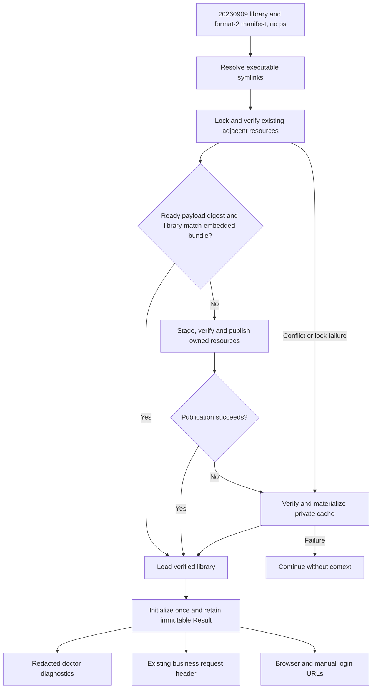

# Runtime context

DWS embeds runtime payload `20260909` in its single executable. Five libraries
cover macOS, Linux, and Windows on amd64 and arm64; macOS shares a universal
library. Each target contains only its library and a format-2 manifest. The
retired `ps/` directory and Win32 DLL are not distributed. Payload slots reserve
1 MiB on macOS/Linux and 4 MiB on Windows, including room for signed libraries.

The macOS library was refreshed on 2026-09-11 from the provider-supplied
`x7k2m9p4q1w8_Dynamic.zip`; its source and library checksums are recorded in the
[payload notice](../third_party/runtimepayload/20260909/NOTICE.md).
The collection version stays `20260909`. A changed payload digest upgrades an
owned adjacent library and selects a separate cache directory even when the
version is unchanged. Linux and Windows retain their existing payloads.

## Materialization and recovery

The loader resolves the executable's symbolic links before choosing its parent
directory. Homebrew therefore uses the real binary in `libexec`, not the link in
`bin`. It never selects the process working directory.

```text
<resolved-executable-directory>/
  dws (or dws.exe)
  <platform-library>
  .dws-runtime-manifest.json
  .dws-runtime.lock
```

A nonblocking cross-process lock serializes adjacent publication. For an existing
ready bundle with the same payload digest, DWS reads the trusted manifest directly
from the verified embedded archive, compares it with the ownership record, and
checks every published resource once. Reuse does not create a staging directory
or extract another copy of the payload.

Installation and repair extract the embedded container into a hidden temporary
directory beside the executable. The dedicated ownership manifest reserves the fixed resource
names before publication (`pending`) and commits the verified result afterward
(`ready`). Existing valid resources are reused. Owned, interrupted or damaged
resources can be repaired; unknown files and symbolic links are never replaced.
Valid format-1 ownership records from `20260825` and `20260908` authorize a
library upgrade. Their old `ps/` directories are left untouched: this version
does not publish, traverse, hash, repair, or require those files.
Interrupted staging directories are not load sources.

If the directory cannot be resolved or written, another publisher holds its
lock, or publication fails (including a loaded Windows DLL), DWS uses a verified
content-addressed cache:

```text
<user-cache>/dws/runtime-context/20260909/<payload-sha256>/
```

Both paths compare the manifest with the embedded bundle and verify the library
checksum before returning a library. A cache cannot authorize replacement bytes
by changing its own manifest. Dedicated build/cache roots contain exactly those two files; adjacent
publication preserves unrelated files beside the executable. Previous-version caches are left
alone and are not used. Failure of both locations leaves the context unavailable
without blocking login or business requests.



## Login authorization URLs

`Result.AttachToURL(rawURL string, allowedHosts []string) (string, bool)` attaches `callerUmt` and
`caller=dws` together only when the context is ready, the URL is HTTPS, and the
hostname is on the current login region's auth-host allowlist (derived from
that region's authorize and device-login bases). HTTP, userinfo, empty
allowlists, and other hosts fail open: the original URL is returned without
private parameters. `redirect_uri` / `redirect` values must be loopback or the
same HTTPS allowlist; otherwise attachment is skipped. It uses URL encoding,
preserves other query parameters and fragments, and replaces duplicate
parameters with one value each.

OAuth's initial browser URL, terminal manual link, and `/api/status`
reauthorization URL use one snapshot. The page consumes the complete
`authorizeUrl` directly. CLI locale selection does not add a `lang` query
parameter to login URLs, including displayed manual links and `--no-browser`.
Device Flow resolves one snapshot before its retry
loop and reuses it for up to three attempts. Both displayed verification URLs
include the parameters; the complete link is also used for automatic browser
launch. This applies to `--no-browser` as well. The original verification
response remains unchanged for polling and token exchange.

Device instructions show the authorization code and expiry together, followed
by the complete link and then the manual-entry link when available. Each URL
occupies its own unstyled logical line outside any frame. Terminal soft wrapping
keeps long links readable without adding hard breaks or truncating parameters.

The terminal intentionally includes the runtime value in copyable manual login
links when initialization succeeds. SDK failure or invalid URLs keep the
original links. Diagnostic logs use original URLs; browser-launch errors
report a neutral category instead of the launcher's error text. The private
value is not persisted as application state or exposed by a token getter.
Doctor reports only state, payload version, length and a short fingerprint.

Callback and redirect URIs, device-code requests, polling, token exchange and
refresh do not receive these query parameters. The existing business-request
`x-dingtalk-ext` header behavior is unchanged. Only `k9Xm2pQv` is called; the
other seven exports are checked for integrity but are not invoked.

## Validation

Run the runtime payload policy script, targeted runtime/auth tests, six
`CGO_ENABLED=0` cross-builds, `make build`, the complete Go suite and `make policy`.
Release archives and npm/Homebrew installers continue to distribute one binary.
Payload injection precedes final code signing. Local ad-hoc signing does not
replace the official Apple Developer ID release verification.
